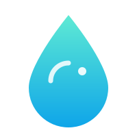

<div align="center">



# Durulaç

### Yapay ve bürokratik Türkçeyi duru bir dile çevirir; ne anlamını bozar ne bir şey uydurur.

    

</div>

Durulaç bir metni alır, içindeki yapay ve bürokratik kalıpları ayıklar, geriye yazarın kendi sesini bırakır. Cümleleri cilalayıp birbirine benzetmez; sayı, tarih ya da iddia uydurmaz. İstersen tek kelimeye dokunmadan sadece bakar: "Bu metin yapay mı?" diye sorarsan, bulduğu kalıpları tek tek, alıntısıyla gösterir.

Kuralları düz Markdown olduğu için tek bir modele bağlı değil. Claude Code, Claude Desktop ve web'de hazır beceri (skill) olarak çalışır; ChatGPT, OpenCode, OpenClaw ve Ollama gibi model ve araçlarda ise sistem yönergesi (system prompt) olarak kullanılır. Nitekim aşağıdaki testler DeepSeek, Qwen, GPT ve Claude ile yapıldı; hepsinde çalışıyor.

## İçindekiler

- [Sorun: yapay dil Türkçede başka türlü görünür](#sorun-yapay-dil-türkçede-başka-türlü-görünür)
- [Bir örnek](#bir-örnek)
- [İki çalışma biçimi](#i̇ki-çalışma-biçimi)
- [Ne yapar, ne yapmaz](#ne-yapar-ne-yapmaz)
- [Kurulum](#kurulum)
- [Kullanım](#kullanım)
- [Nasıl sınandı](#nasıl-sınandı)
- [Sınırları](#sınırları)
- [Katkı](#katkı)
- [Lisans](#lisans)

## Sorun: yapay dil Türkçede başka türlü görünür

Yapaylık Türkçenin kendinde değil; yapay zekânın ve bürokrasinin ürettiği metinde. Üstelik bu metinlerin bıraktığı izler İngilizcedekinden farklıdır. Hazır "humanizer" araçları İngilizceye göre yazılmıştır; onların avladığı şeyler bizde pek işe yaramaz: aşırı uzun çizgi, "X is the Y of Z" kalıbı, birtakım İngilizce dolgu sözcükleri.

Yapay zekâ ve bürokrasi, Türkçede kendini başka yerlerden belli eder:

- İsimleştirme ve şişkin fiiller: "iyileştirilmesi amacıyla optimizasyonlar gerçekleştirilmiştir"
- Bürokratik edatlar: "hususunda", "nezdinde", "bu bağlamda"
- Kanıtsız övgü sıfatları: "yenilikçi, güçlü ve katma değerli çözümler"
- Her konuya uyan klişe girişler: "Günümüzün hızlı tempolu dünyasında..."
- Failini gizleyen edilgen cümleler ve boş vaatler: "hedeflenmektedir", "sağlanmış olup"

Durulaç bu izleri hazır bir listeyi çevirerek değil, Türkçeye göre ve TDK kurallarına dayanarak temizler.

## Bir örnek

Girdi (yapay, kurumsal bir paragraf):

> Günümüzün hızlı tempolu dünyasında, dijital dönüşüm süreçleri işletmeler açısından büyük önem arz etmektedir. Şirketimiz, müşteri memnuniyetini en üst düzeye çıkarmak amacıyla yenilikçi, güçlü ve katma değerli çözümler sunmaktadır. Bu bağlamda, geçtiğimiz dönemde birçok proje hayata geçirilmiş ve olumlu geri dönüşler alınmıştır.

Durulaç'tan sonra:

> Müşteri memnuniyeti bizim için öncelikli, çünkü işimizin sürekliliği ona bağlı. Geçtiğimiz dönemde birçok projeyi tamamladık ve kullanıcılardan olumlu dönüşler aldık.

Klişe giriş, "önem arz etmektedir", boş sıfat dizisi ve "bu bağlamda" çıkarıldı. Edilgen cümleler tek ve tutarlı bir "biz" sesine döndü; kopuk kalanlar bağlaçla birbirine bağlandı. "Fark yarattık" iddiası kanıtı olmadığı için silindi; metinde onu destekleyen veri yoktu. Hiçbir sayı ya da olgu eklenmedi.

## İki çalışma biçimi

**Temizle (varsayılan).** Metni en az müdahaleyle yeniden yazar. Tam metni verir, altına neyi neden değiştirdiğini kısaca sıralar.

**Tespit et.** Hiçbir şeyi yeniden yazmaz. Bulduğu her kalıbı adıyla ve kısa bir alıntıyla gösterir, düzeltme yönünü söyler. "Bunu yapay zekâ mı yazdı?" sorusuna kimin yazdığını tahmin ederek değil, yalnızca metinde görünen kalıpları sayarak yanıt verir. Yüzde ya da olasılık vermez; tespit kesin değildir, hafif bir yeniden yazma kalıpları silebilir. Bu yüzden çıktısı "şu kalıplar görülüyor" der, "bu metin yapaydır" demez.

## Ne yapar, ne yapmaz

Yapar:

- Metnin türünü önce belirler ve her türe kendi kuralıyla yaklaşır. Resmî yazı, dilekçe, akademik makale ve sözleşmede o türe özgü kalıplar (edilgen çatı, "arz ederim", "işbu") bilinçlidir; onlara dokunmaz. Haberde kaynak atfını, altyazıda kısa satırları, sosyal medyada hashtag ve emojiyi, edebî metinde devrik cümleyi korur.
- Sohbeti sohbet bırakır. Devrik cümleyi, günlük dolguyu, "bence" gibi yumuşatıcıları ve kişisel sesi rapor diline çevirmez.
- Elli kalıp aşkın yapay/bürokratik kalıbı tanır: klişe giriş, boş sıfat dizisi, plaza İngilizcesi, sahte-derin kapanış ve daha fazlası. Yerleşik olmayan eş dizimleri de düzeltir ("etki üretmek" yerine "etki yaratmak").
- Bir şey silerken yerine akış bırakır. Dolgu attığında cümleleri kopuk kopuk bırakmaz, bağlaçla toparlar.
- Sadeleştirir, özetlemez. Kelime yükünü azaltır ama bilgi taşıyan cümleyi atmaz.

Yapmaz:

- Kod bloklarına, komutlara, tablolara ve teknik adlara karışmaz.
- "commit", "pull request" gibi kavram adlarını çevirmez; yalnız "merge etmek" gibi plaza fiillerini Türkçeleştirir ("birleştirmek").
- Metinde olmayan sayıyı, tarihi ya da iddiayı asla uydurmaz. Kanıtsız iddiayı ya işaretler ya da çıkarır.
- Zaten doğal olan cümleyi güya iyileştirmek için ellemez.

## Kurulum

Beceri klasörüne klonlamak yeterli:

```bash
git clone https://github.com/mesutbsdgn/turkce-ai-durulac.git ~/.claude/skills/turkce-ai-durulac
```

Beceri dizinin farklıysa (örneğin `~/.agents/skills/`) oraya klonla. Claude bir sonraki oturumda beceriyi kendiliğinden tanır.

**Başka bir modelde ya da araçta (ChatGPT, OpenCode, OpenClaw, Ollama…):** kurulum gerekmez. `SKILL.md` dosyasının içeriğini sistem yönergesi (system prompt / özel talimat) olarak yapıştır; ince ayar istiyorsan `references/degistirme-sozlugu.md` sözlüğünü de ekle. Model bunları okuyup aynı kurallarla çalışır. Zayıf modeller kuralları daha eksik uygular; kurumsal/resmî metinde güçlü bir model tercih et.

## Kullanım

Doğal dille istemen yeterli; dilersen adıyla da çağırabilirsin:

```
/turkce-ai-durulac
Şu metni sadeleştir: <metin>
```

Birkaç örnek istek:

- "Bu duyurunun kurumsal kokusunu al." Temizle biçiminde çalışır.
- "Bu paragraf yapay mı, kalıpları göster." Tespit biçiminde çalışır, metne dokunmaz.
- "Şu mesajı sadeleştir." Sohbet tonunu korur, resmîleştirmez.
- "Bu teknik yazıyı düzelt." Kodu ve terimleri bırakır, yalnız düzyazıyı toparlar.

## Nasıl sınandı

Durulaç körü körüne "iyidir" denmedi; birkaç turluk kontrollü deneyle ölçüldü. Farklı modeller (DeepSeek, Qwen, GPT-6 Luna) aynı metinleri hem beceriyle hem becerisiz temizledi, bağımsız bir model (Claude Sonnet) sonuçları kör puanladı. Ardından Claude Opus 4.8 kırmızı takım gözüyle yedi sistematik eksik buldu; hepsi kapatıldı. Sonraki turda dört yeni tür kapısı (altyazı, sosyal medya, haber, edebî) ve yeni kalıplar eklendi, aynı koşullarda yinelenen testte gerileme çıkmadı (güçlü uygulayıcıda ortalama 9,9/10). Son olarak sözlük derinleştirmesi A/B testiyle seçildi.

Öğrendiklerimiz:

- Farklı modellerle çalışması, becerinin tek bir modele bağlı olmadığını da gösterdi.
- Becerinin asıl katkısı yalnızca kalıp silmek değil, güçlü bir modelin fazla düzeltmesini frenlemek. Modelin teknik terimi ya da sohbet tonunu bozmasını engelliyor.
- Zayıf bir modelin gözünden kaçan boş sıfatları ve klişeleri yakalatıyor.
- Uydurma yasağı hem uygulayan hem puanlayan modelce doğrulandı: üslup düzeliyor ama metne olgu eklenmiyor.

Bütün deney kayıtları [`docs/deneyler.md`](docs/deneyler.md) dosyasında. Örneklem küçük ve puanlar bir modelin yargısı olduğundan sonuçlar kesin ölçü değil, yön gösterir.

## Sınırları

- Sonuç uygulayan modele bağlı. Güçlü bir model beceri olmadan da iyi yazabilir; kurumsal metin temizliğinde güçlü bir model önerilir.
- Beceri bir korkuluktur, sihirli değnek değil. Aradığın hatayı temizler, ama güzel üslubu garanti etmez.
- Son söz sende. Altındaki değişiklik listesini oku, onaylamadığını geri al.

## Katkı

Yeni bir kalıp, sözlük eşlemesi ya da "şuna dokunmamalı" örneği önereceksen issue veya pull request aç. Her kalıp için sorunu, kötü bir örneği ve düzeltilmiş halini ver; dayanağını TDK'ye bağla. Metinde olmayan bir olguyu uyduran örnek kabul edilmez.

## Lisans

MIT ([LICENSE](LICENSE)).

Yapısı [petergyang/no-ai-slop](https://github.com/petergyang/no-ai-slop) (MIT) projesinden esinlendi; İngilizce içerik kopyalanmadı, her şey Türkçeye özgün yazıldı. Değiştirme sözlüğü [Denomas/Turkce-yazim-denetimi](https://github.com/Denomas/Turkce-yazim-denetimi) (MIT) kurallarından seçilerek uyarlandı. Dil bilgisi ve noktalama [TDK Yazım Kılavuzu](https://tdk.gov.tr/) temel alındı. Ayrıntılı notlar: [LICENSE-NOTES.md](LICENSE-NOTES.md).
